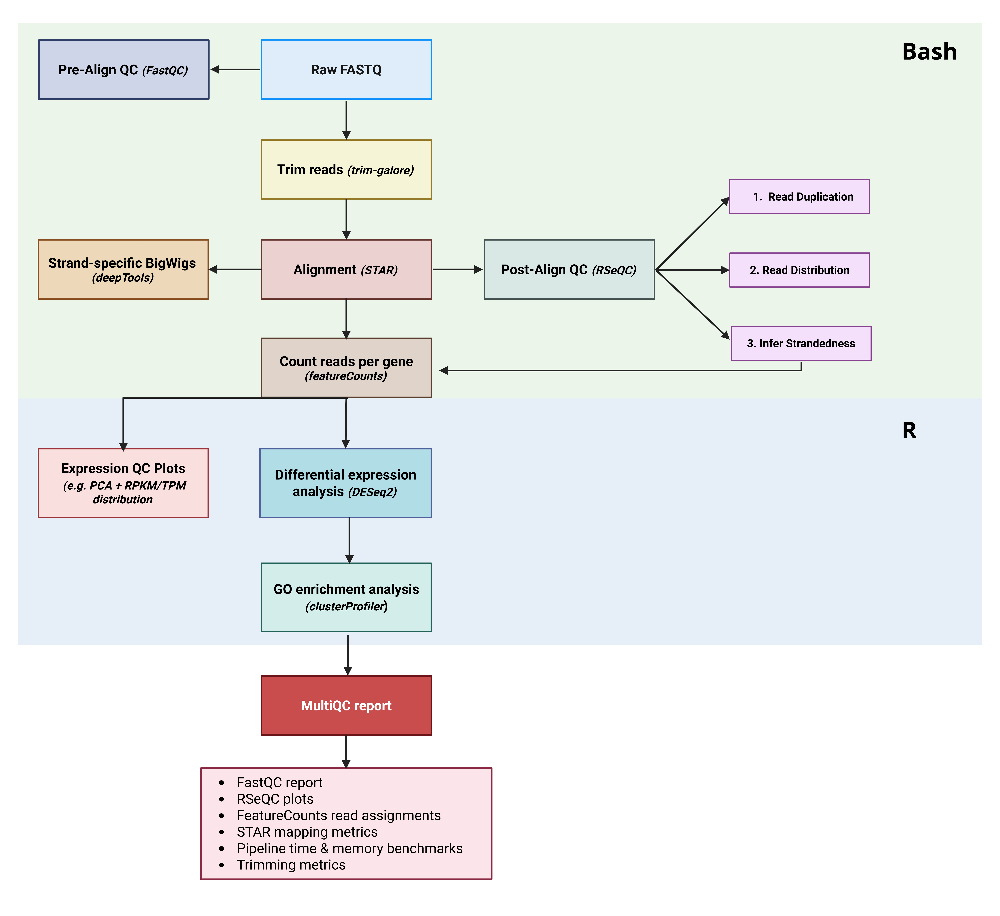

# RNA-seq Snakemake pipeline

Snakemake-based RNA-seq pipeline for read trimming, splice-aware mapping, strand-specific coverage track generation, automated strandedness inference, gene-level quantification, differential expression (DESeq2), and comprehensive MultiQC reporting.

The pipeline is run per experiment ID (**EXP_ID**). It expects a sample sheet at `config/samples_<EXP_ID>.tsv` and writes outputs to `results_<EXP_ID>/`.

---

## Repository contents

- `Snakefile` — main workflow
- `run_pipeline.sh` — wrapper for SLURM submission / dry-run / unlock / touch 
- `slurm_status.sh` — helps Snakemake track job status so it can deem timed-out jobs as failures and mark them for auto-restart with more submission time
- `setup_experiment.py` — generates `config/samples_<EXP_ID>.tsv`, `config/metadata_<EXP_ID>.tsv`, and `config/comparisons_<EXP_ID>.tsv` by scanning a FASTQ directory and applying condition/replicate mappings.
- `run_deseq2.R` — custom DESeq2 script that generates DE tables, PCA, MA/Volcano plots, heatmaps, and GO enrichment.
- `config/`
  - `config.yaml` — reference paths and tool parameters (STAR index, multimap limits, DESeq2 thresholds).
  - `containers/` — local cache for Apptainer/Singularity images, populated automatically on first run.

---

## Workflow overview (rules)

| Stage | Rule(s) | What it does | Main outputs |
|------:|---------|--------------|--------------|
| 1 | `fastqc_pe`, `fastqc_se` | Raw read quality control | `results_<ID>/qc/fastqc/*.html` |
| 2 | `trim_pe`, `trim_se` | Adapter/quality trimming for paired-end / single-end reads | `results_<ID>/trimmed/*.fq.gz` |
| 3 | `star_pe`, `star_se` | Splice-aware alignment, coordinate-sort BAM and index | `results_<ID>/mapped/*_Aligned.sortedByCoord.out.bam` |
| 4 | `bigwig` | Create strand-specific CPM-normalized coverage tracks | `results_<ID>/bigwig/*_fwd.bw`, `*_rev.bw` |
| 5 | `rseqc_*`, `infer_strandedness` | Compute duplication rates, read distribution, and auto-infer strandedness | `results_<ID>/qc/rseqc/*_strandedness.flag`, etc. |
| 6 | `featurecounts`, `merge_counts`| Count reads per gene (using auto-inferred strand logic) and merge into a single matrix | `results_<ID>/counts/gene_counts_matrix.tsv` |
| 7 | `deseq2` | RPKM/TPM calculation, PCA, DEGs, heatmaps, MA/Volcano plots, GO enrichment | `results_<ID>/deseq2/deseq2_summary.csv`, `pca_plot.png` |
| 8 | `count_pipeline_stats` | Generate MultiQC custom tables (runtime/memory from Snakemake benchmarks) | `results_<ID>/qc/*_mqc.tsv` |
| 9 | `multiqc` | Aggregate QC, mapping logs, RSeQC stats, and counts into an HTML report | `results_<ID>/qc/multiqc_report.html` |





Example MultiQC report is available in the `Example_multiqc_report.html` file in the repository and can be opened directly in a browser after downloading it to your local machine.

---


## Requirements

- Conda (Miniconda/Anaconda)
- A reference genome indexed with STAR version 2.7.4a and a matching GTF annotation file (the pipeline can generate this for you)
- A working Snakemake installation with **Apptainer** (formerly Singularity)
- Cluster submission is handled by `run_pipeline.sh` via `sbatch` (SLURM)
- Tools used by the workflow are provided via containers (Singularity/Apptainer) defined in the Snakefile rules.

---

## 1) First-time installation (do once)

### 1.1 Environment configuration

Create a lightweight environment that runs Snakemake, parses the sample sheet, and includes Apptainer. All bioinformatics tools (STAR, DESeq2, RSeQC, etc.) are pulled as containers.

```bash
conda create -n snakemake-c -c bioconda -c conda-forge snakemake pandas apptainer
```

> **Note on Containers:** The workflow uses `--use-singularity` to run per-rule containers. The first time you run the pipeline, Snakemake will automatically pull the required Docker images and convert them to Apptainer (`.sif`) images in `config/containers/`.

### 1.2 Clone the github repo

On your cluster or workstation, clone the repository and enter the folder:

```bash
git clone git@github.com:GavinKarsters/rna_seq_snakemake.git
cd rna_seq_snakemake
```

If you have not set up SSH keys for GitHub on your machine, you can clone via HTTPS instead:

```bash
git clone https://github.com/GavinKarsters/chip_seq_snakemake.git
cd chip_seq_snakemake
```

### 1.3 (Optional) Download and Index Reference Genome

If you do not already have a STAR index and GTF for your genome (human/mouse), the pipeline can generate one using GENCODE references. 

1.  **Activate environment:**
    ```bash
    conda activate snakemake-c
    cd rna_seq_snakemake
    ```

2.  **Run the generator command:**
    Run this command to download the FASTA/GTF and build the index. Replace `human` with `mouse` if needed.
    
    ```bash
    snakemake --jobs 1 \
      --cluster "sbatch --partition=cpu --time={resources.runtime} --mem={resources.mem_mb}M --cpus-per-task={threads} --gres=tmpspace:170G" \
      --use-singularity \
      references/star_index_human --config id=SETUP
    ```

3.  **Update config:**
    Once finished, take the absolute paths to the new STAR directory and `.gtf` file and update your `config/config.yaml`.

---

## 2) Configure a new experiment

### 2.1 Activate Snakemake environment

```bash
conda activate snakemake-c
```

### 2.2 Edit the config paths (one time only)

Open `config/config.yaml` and edit the paths to your reference genome(s) and the STAR index. You can also tweak pipeline behaviors like `multimap_max` or DESeq2 thresholds (`lfc_threshold`, `padj_threshold`).

### 2.3 Edit the experiment setup logic

Open `setup_experiment.py` and edit the **USER CONFIGURATION** section:

- `RAW_DIR`  
  Directory containing gzipped FASTQs for the experiment.
- `CONDITION_MAPPING`  
  Map sample ID numbers to their respective biological conditions and replicate numbers. 
  
  The setup script assumes your FASTQs follow a naming pattern like:
  `100-SampleName_S1_R1_001.fastq.gz`  
  where the leading number is the numeric ID used in `CONDITION_MAPPING`.
  
  If your FASTQs do not have numeric prefixes, you can easily add them:
  ```bash
  # example: prepend incremental IDs (1, 2, 3, ...) to all fastqs
  i=1
  for f in *.fastq.gz; do
    mv "$f" "$i-$f"
    i=$((i+1))
  done
  ```
- `COMPARISONS`  
  Define the comparisons for DESeq2 as `["Treatment", "Reference"]`. The output will calculate log2 fold changes of Treatment over Reference.

### 2.4 Generate the sample sheet and metadata

```bash
#example using DAAO_EXP experiment ID
python setup_experiment.py -e DAAO_EXP -g human
```

This creates 3 crucial files in the `config/` directory:
- `samples_DAAO_EXP.tsv` (Used by Snakemake for FASTQ paths)
- `metadata_DAAO_EXP.tsv` (Used by DESeq2 for sample/condition assignments)
- `comparisons_DAAO_EXP.tsv` (Used by DESeq2 for contrast definitions)

---

## 3) Run the pipeline

### 3.1 Enable DESeq2 (Optional but recommended)
By default, the pipeline does not run DESeq2 unless instructed. To run it, ensure you add the `-d` flag when running the pipeline.

### 3.2 Dry-run (recommended before launching)

```bash
./run_pipeline.sh -e DAAO_EXP -n -d
```

During dry-run, check:
- Job count looks correct based on amount of samples.

### 3.3 Run the pipeline for a specific experiment ID (on SLURM):

```bash
./run_pipeline.sh -e DAAO_EXP -d
```

### 3.4 Unlock (if Snakemake crashed previously)

```bash
./run_pipeline.sh -e DAAO_EXP -u
```

### 3.5 Touch mode

If you changed code/parameters or simply some comments within certain rules but want Snakemake to treat existing outputs as up-to-date to prevent re-running those rules:

```bash
./run_pipeline.sh -e DAAO_EXP -t "trim_pe trim_se star_pe star_se"
```
---

## 4) Outputs

Outputs are written to `results_<EXP_ID>/`:

- `trimmed/` — Trimmed FASTQs.
- `mapped/` — Splice-aware BAMs + `.bai` index files + STAR logs.
- `bigwig/` — Forward (`_fwd.bw`) and Reverse (`_rev.bw`) strand-specific, CPM-normalized coverage tracks.
- `counts/` — Raw featureCounts output per sample + `gene_counts_matrix.tsv` containing all samples merged.
- `qc/`
  - `fastqc/` — FastQC HTML reports.
  - `dedup/` — RSeQC duplication stats.
  - `rseqc/` — Strand inference, gene body coverage, and junction annotations.
  - `multiqc_report.html` — The master aggregated QC report.
- `deseq2/` *(If enabled)*
  - `geneRPKM_TPM_table.tsv` & `geneCOUNT_table.tsv` — Normalized and raw count matrices.
  - `pca_plot.png` & Library size / distribution boxplots.
  - `deseq2_summary.csv` — Master summary of all comparisons.
  - `<Treatment>_vs_<Reference>/` — Folders per comparison containing Volcano plots, MA plots, Heatmaps, significant/all gene tables, and GO enrichment data.

---

## FAQ

- **How is library strandedness handled?**  
  The pipeline takes the guesswork out of library prep. It runs RSeQC's `infer_experiment.py` on a subset of mapped reads to determine if the library is Unstranded, Forward-stranded, or Reverse-stranded. It outputs a `flag` file which is dynamically passed directly to `featureCounts` (as `-s 0`, `-s 1`, or `-s 2`).

- **Why are there two BigWig files per sample?**  
  Unlike ChIP-seq, RNA-seq libraries are often strand-specific. The pipeline separates signal by strand (using deepTools `--filterRNAstrand`) into `_fwd.bw` and `_rev.bw` tracks. This allows you to visualize sense and antisense transcription independently in genome browsers like IGV.

- **The pipeline finished succesfully but I saw some rules producing error messages for some jobs**  
  Each rule gets a fixed amount of runtime allocated, which is usually enough for 85% of all samples. If a job times out, the `slurm_status.sh` script marks it as a failure and Snakemake auto-restarts it with up to 3x, and eventually 6x, the initial time. If the final `multiqc_report.html` and `deseq2_summary.csv` are generated, the run was successful.

- **How does DESeq2 know which samples to compare?**  
  The `setup_experiment.py` script requires you to define `CONDITION_MAPPING` and `COMPARISONS`. It builds a specific `metadata.tsv` and `comparisons.tsv` file. The custom `run_deseq2.R` script uses these files to group replicates and automatically set up the correct Treatment vs Control contrasts.